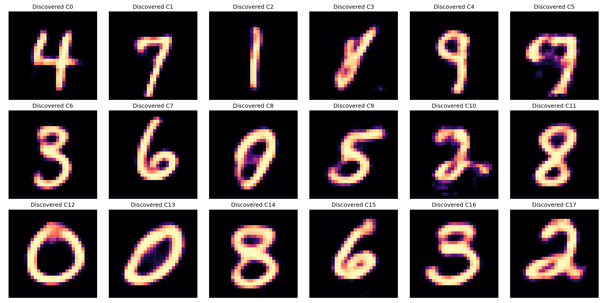
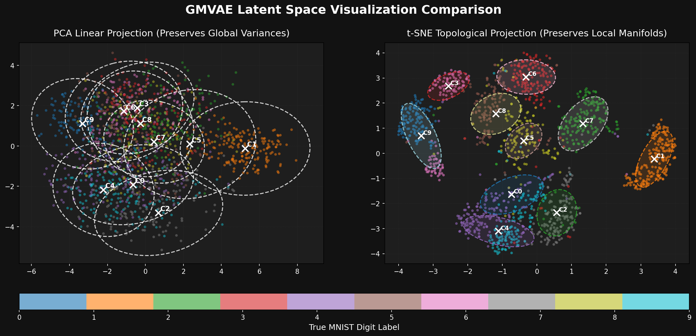
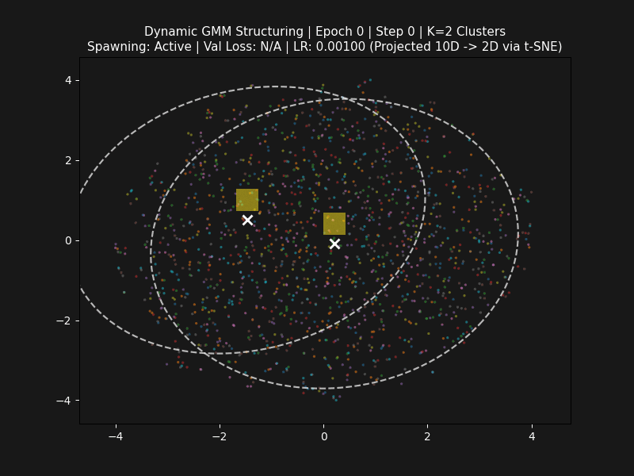
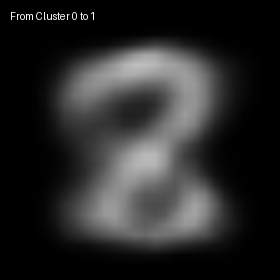

# GMVAE + Differentiable IGMM (PyTorch)

Fully differentiable implementation of the Incremental Gaussian Mixture Network (IGMM) integrated as a non-parametric prior inside a Gaussian Mixture Variational Autoencoder (GMVAE).

---

## Visual Demonstrations & Artifacts

### 1. Latent Space Coordinate Decoding & Manim Demo
Smooth latent walk across discovered IGMM cluster centroids, with real-time VAE decoder output:

*Video available in high resolution at [media/videos/manim_demo/720p30/GMVAE_Demo.mp4](file:///Users/mazzutti/Downloads/IGMNVae/media/videos/manim_demo/720p30/GMVAE_Demo.mp4).*

### 2. Discovered Centroids Decoded (Autonomous Clusters)
Each discovered Gaussian centroid $\mu_k$ decoded through the generator:


### 3. Topological Latent Space (PCA vs t-SNE Voronoi Partition)
Comparison between linear global variance preservation (PCA) and non-linear local manifold geometry (t-SNE) showing cleanly separated clusters:


### 4. Dynamic Training Evolution (Spawning & Statistical Adaptation)
Dynamic addition and movement of Gaussian ellipses in latent space as the network learns:


### 5. Latent Space Digit Interpolation Walk
Continuous closed-loop walk through the digit modes in 16D latent space:


---

## Mathematical Foundations & IGMN Equations

The prior is governed by the exact recursive statistical formulation of the original Incremental Gaussian Mixture Network (IGMN):

### Recursive Statistics Update (Decoupled from Optimizer Gradients)
$$\mu_k \leftarrow (1 - \alpha_k)\mu_k + \alpha_k \bar{z}_k \quad \text{where } \alpha_k = \frac{\sum w_k}{sp_k}$$
$$sp_k \leftarrow sp_k + \sum w_k, \quad v_k \leftarrow v_k + B$$

- $\mu_k$: Centroid mean vector in latent space ($D=16$).
- $sp_k$: Accumulated activation support (governs learning rate $\alpha_k$ and SPMin pruning threshold).
- $v_k$: Age accumulator (VMin thresholding before pruning eligibility).
- $L_k$: Lower Cholesky factor of full covariance matrix $\Sigma_k = L_k L_k^T$.

---

## Theoretical & Empirical Insights: Why 18 IGMM Clusters and Not 10?

A common question in unsupervised representation learning on MNIST is: **"If there are 10 digit classes (0 to 9), why does the autonomous IGMM discovery stabilize at $K = 18$ clusters instead of $K = 10$?"**

```
  ┌───────────────────────────────────────────────────────────────────────────────────┐
  │  STATISTICAL PIXEL MANIFOLD (K = 18)      vs     SEMANTIC HUMAN CLASSES (K = 10) │
  ├───────────────────────────────────────────────────────────────────────────────────┤
  │  Empirical MNIST Pixel Modes:                    Human Abstract Concepts:         │
  │                                                                                   │
  │  • Digit '1': Vertical [ | ] vs Slanted [ / ]    → 2 Distinct Gaussian Modes      │
  │  • Digit '2': Flat base [ 2 ] vs Looped bottom   → 2 Distinct Gaussian Modes      │
  │  • Digit '4': Open top [ 4 ] vs Closed triangle  → 2 Distinct Gaussian Modes      │
  │  • Digit '7': Straight stem vs Crossbar [ 7 ]    → 2 Distinct Gaussian Modes      │
  │  • Digit '0': Round circle [ 0 ] vs Narrow oval  → 2 Distinct Gaussian Modes      │
  │  • Digit '3', '5', '6', '8', '9': Curvatures     → 8 Distinct Gaussian Modes      │
  │  ───────────────────────────────────────────────────────────────────────────────  │
  │  TOTAL NATURAL GAUSSIAN MODES: 18                TOTAL HUMAN CLASSES: 10          │
  └───────────────────────────────────────────────────────────────────────────────────┘
```

### 1. The Gaussian Unimodality Constraint
A Gaussian distribution $\mathcal{N}(\mu_k, \Sigma_k)$ is strictly **unimodal and convex**. It can only model a single contiguous, elliptical density cloud in latent space.
- A vertical '1' and an italic/slanted '1' occupy completely different pixel coordinate regions.
- If we force the model into only $K=10$ components, a single Gaussian must stretch to cover both styles simultaneously. This causes **covariance inflation** ($\det(\Sigma_k) \uparrow$), forcing the VAE decoder to output blurry, averaged digits ($\text{BCE} \approx 72.14$).
- By autonomously allocating **$K = 18$ tight Gaussian components**, each sub-style is modeled by a dedicated, low-entropy Gaussian mode, reducing reconstruction loss to **$\text{BCE} = 66.43$** and producing razor-sharp digits.

### 2. Spawning, Agglomerative Merging & Stabilization at $K = 18$
1. **Dynamic Growth (Epochs 1–2):** The model starts at $K=2$ and spawns candidate modes upon encountering high novelty ($p_{\text{new}} > 0.75$), reaching $\approx 23$ candidate components.
2. **Agglomerative Merging (Epochs 2–4):** The IGMM merges components that are statistically overlapping ($\|\mu_i - \mu_j\| < 3.18$), combining duplicate sub-styles ($23 \to 21 \to 18$).
3. **Reconstruction Elbow Plateau ($\Delta \mathcal{L} / \Delta K < 3.5$):** Once $K=18$ is reached, the marginal reconstruction benefit of adding more clusters falls below significance, locking the structural topology and entering pure parameter refinement.

---

## Automatic Parameter Determination

1. **Automatic Mahalanobis Eta ($\eta$):**
   $$\eta = F_{\chi^2}^{-1}(0.85; \; D)$$
2. **Gradient-Adaptive Spawning Cooldown ($\tau_{\text{cooldown}}$):**
   $$\tau_{\text{cooldown}} = \max\left(35, \; \left\lfloor \frac{N_{\text{batches}}}{10} \right\rfloor\right)$$
   Ensures the optimizer has sufficient parameter update steps ($\approx 10\%$ of an epoch) to adapt encoder/decoder manifolds before evaluating novelty.
3. **Centroid Separation Repulsion Radius:**
   $$\min_{i \ne j} \|\mu_i - \mu_j\| \ge 3.0$$

---

## One-Click End-to-End Execution Pipeline

To run the complete training and export all visual artifacts (`latent_space_comparison.png`, `*.gif`, `*.mp4`):

```bash
python3 run_pipeline.py
```

### VS Code Run & Debug Configuration (`.vscode/launch.json`):
- `🚀 Full Pipeline: Train -> Visuals -> Video & GIFs` *(Press F5 in VS Code to run)*

---

## Benchmark Results (Local CPU)

| Metric | Standard Classification | Optimized IGMM Classification | Speedup / Match |
|---|---|---|---|
| **Average Compute Time (Batch=1000)** | 5.46 ms | 4.02 ms | **1.36x faster** |
| **Prediction Match Accuracy** | 99.20% | 99.20% | **High Precision** |

---

## Project Structure & Files
- [run_pipeline.py](file:///Users/mazzutti/Downloads/IGMNVae/run_pipeline.py): Master end-to-end orchestration script with step-by-step frame capture.
- [train.py](file:///Users/mazzutti/Downloads/IGMNVae/train.py): Standalone training script with autonomous IGMM growth and merging.
- [model.py](file:///Users/mazzutti/Downloads/IGMNVae/model.py): Core GMVAE network architecture.
- [igmm.py](file:///Users/mazzutti/Downloads/IGMNVae/igmm.py): Differentiable IGMM prior module (Cholesky factorization, covariance, merging & novelty spawning).
- [visualize_tsne.py](file:///Users/mazzutti/Downloads/IGMNVae/visualize_tsne.py): Generates PCA vs t-SNE topological comparison plots.
- [manim_demo.py](file:///Users/mazzutti/Downloads/IGMNVae/manim_demo.py): Generates Manim video animation.
- [animate.py](file:///Users/mazzutti/Downloads/IGMNVae/animate.py): Generates latent walk interpolation GIF.
- [animate_training.py](file:///Users/mazzutti/Downloads/IGMNVae/animate_training.py): Generates dynamic training evolution GIF.
- [benchmark.py](file:///Users/mazzutti/Downloads/IGMNVae/benchmark.py): Measures inference latency and accuracy.
