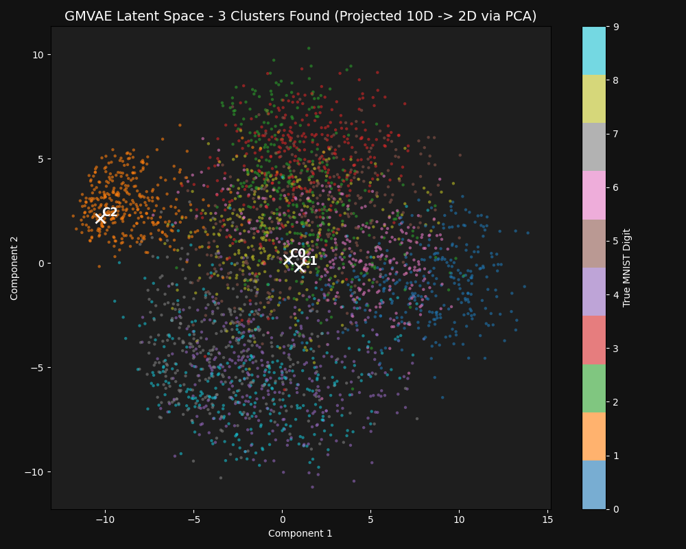
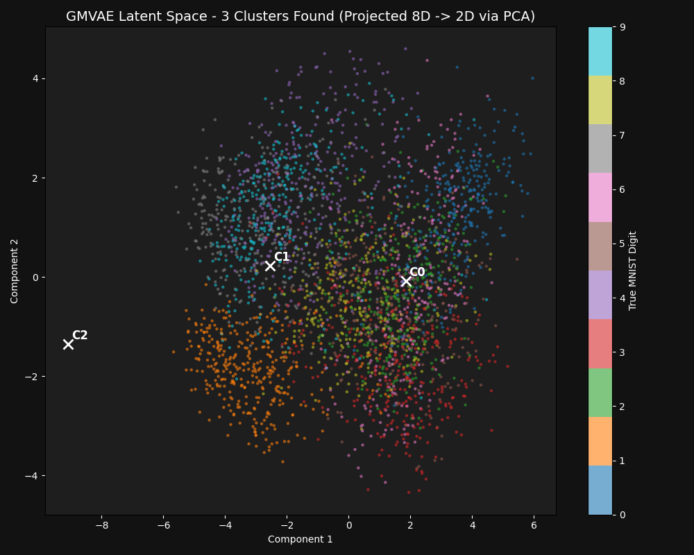
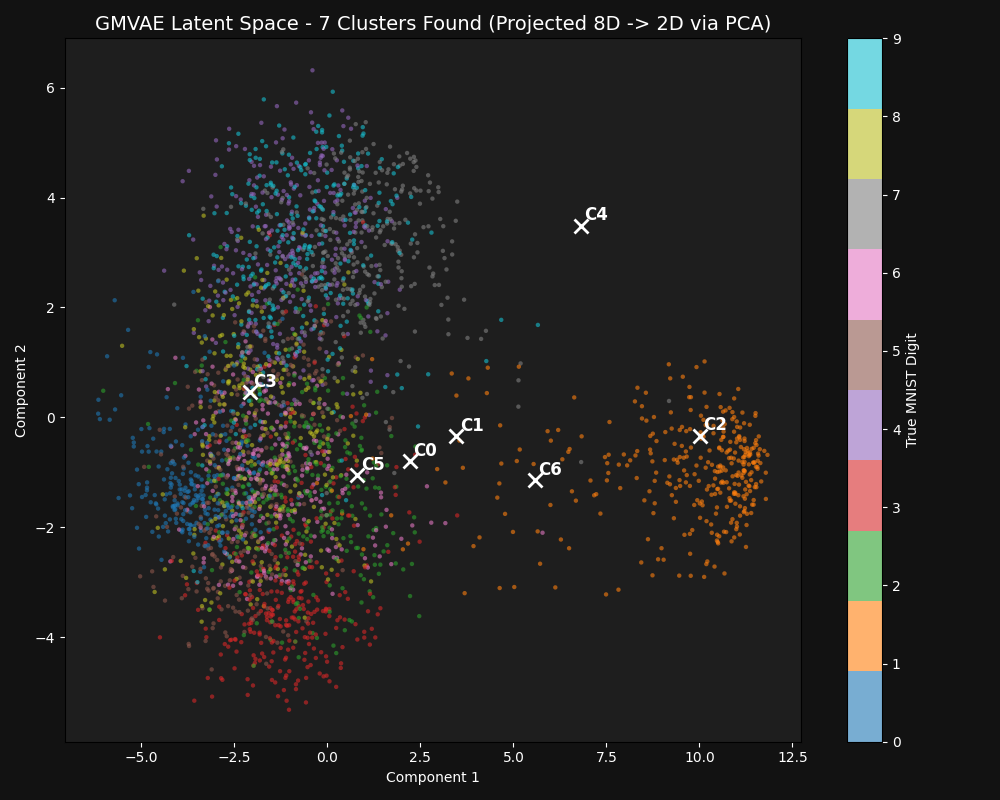
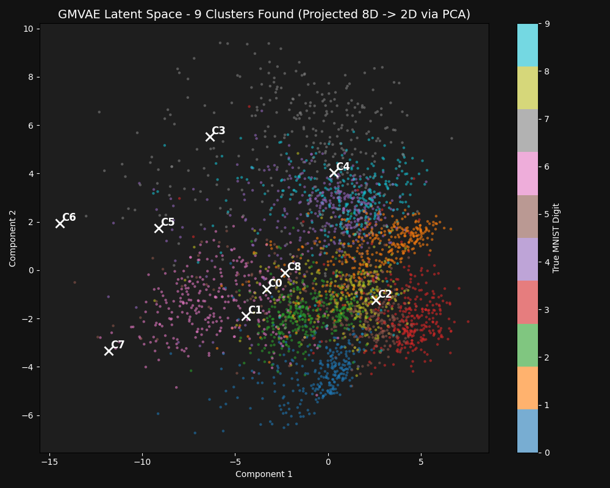

# Differentiable IGMN + GMVAE Results

Differentiable IGMN acts as prior in GMVAE latent space. It dynamically grows clusters based on Mahalanobis distance.

## Manim Mathematical Visualization

The mathematical animation below, built using **Manim (Python)**, demonstrates the coordinate-to-image decoding mapping:
1. **Coordinate Plane (Left)**: Shows the latent variables $z$ projected onto a 2D plane. The crosses represent the GMM cluster centroids discovered by the IGMN, surrounded by their standard deviation covariance ellipses.
2. **Reconstruction Window (Right)**: Shows the real-time VAE Decoder output.
3. **Latent Walk**: A dot interpolates smoothly between cluster centers, and the floating image updates dynamically to display the continuous morphing of handwritten digit structures.

---

## Training Evolution: Structuring the Latent Space

The training animation below demonstrates the VAE's 2D latent space over 25 epochs (updated every 100 steps). You can observe:
1. **Dynamic Spawning**: As the encoder maps new digits to the latent space, outliers trigger $p_{\text{new}} > 0.85$ and spawn new Gaussian components (represented by white ellipses).
2. **Prior Adaptation**: GMM ellipses dynamically move and rotate (adapting their means and full covariances) to align with the emerging digit classes.
3. **Pruning**: Spurious or redundant components (outliers with low priors $\pi_k < 0.005$) are actively pruned from the parameters at the end of each epoch, stabilizing the mixture model.

---

## Automated GMM Cluster Count (K) Optimization

We automated the discovery of the optimal number of GMM components $K$ using two integrated mechanisms:
1. **Dynamic Chi-squared ($\chi^2$) Thresholding**:
   Instead of a static threshold $\eta$, the script dynamically calculates $\eta = \text{ppf}(0.99, D_{\text{active}})$ using the cumulative distribution function of the Chi-squared distribution at 99% confidence level. If dimension selection methods (like ARD or PCA) change the active dimensionality of the latent space, the outlier detection threshold scales down automatically (e.g. from 23.21 for 10D to 9.21 for 2D).
2. **Validation ELBO Monitoring (Early Freezing)**:
   We evaluate the model on the test dataset at the end of each epoch. Since validation ELBO directly balances reconstruction quality and model complexity (number of active clusters), we monitor the validation loss. If it plateaus (does not improve for 2 consecutive epochs), we freeze cluster spawning (`allow_spawning = False`) to prevent overfitting.

### Discovered Latent Space (Dynamic Optimization)

---

## GMM Covariance Types

We implemented support for two covariance types (selectable via `--covariance_type`):
1. **Full Covariance (Default)**: Uses Cholesky decomposition $L_k$ to represent $\Sigma_k = L_k L_k^T$. Highly expressive, matches the standard IGMN algorithm formulation.
   * *Stability Note*: Since PyTorch's MPS backend has numerical bugs backpropagating through `solve_triangular`, the script automatically detects Apple Silicon and falls back to CPU for training stability in full covariance mode.
2. **Diagonal Covariance**: Uses diagonal $\sigma^2_k$ elements. Very fast and lightweight, ideal for basic embedding layouts.

---

## Latent Dimension Selection Methods

We implemented 3 versions to dynamically determine `latent_dim`:
1. **ARD (Automatic Relevance Determination)**: Sparsity-inducing scaling factor $\alpha_d$ per dimension with L1 penalty. Unused dimensions are shrunk to zero.
2. **KL-Pruning**: Variance Collapse Detection. Unused dimensions collapse to prior $\mathcal{N}(0, 1)$ and are automatically masked out.
3. **PCA**: Covariance matrix analysis over batch. Projects latent coordinates onto eigenvectors and dynamically drops dimensions with eigenvalues below a threshold.

### Plots

| Method | Discovered Latent Space |
| --- | --- |
| **ARD** |  |
| **KL-Pruning** |  |
| **PCA** |  |

---

## Animated Digit Interpolation

The GIF below shows a walk in the 2D latent space, smoothly morphing the generated digits between the means of the IGMN clusters found by the Differentiable IGMN:

## Implementation Files
- Model: [model.py](file:///Users/mazzutti/Downloads/IGMNVae/model.py)
- Encoder: [encoder.py](file:///Users/mazzutti/Downloads/IGMNVae/encoder.py)
- Decoder: [decoder.py](file:///Users/mazzutti/Downloads/IGMNVae/decoder.py)
- IGMN Prior: [igmn.py](file:///Users/mazzutti/Downloads/IGMNVae/igmn.py)
- Train Script: [train.py](file:///Users/mazzutti/Downloads/IGMNVae/train.py)
- Animation Script (Morphing): [animate.py](file:///Users/mazzutti/Downloads/IGMNVae/animate.py)
- Animation Script (Training Evolution): [animate_training.py](file:///Users/mazzutti/Downloads/IGMNVae/animate_training.py)
- Manim Script: [manim_demo.py](file:///Users/mazzutti/Downloads/IGMNVae/manim_demo.py)
